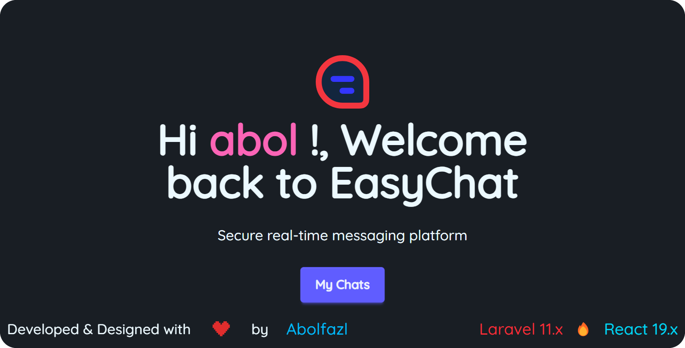
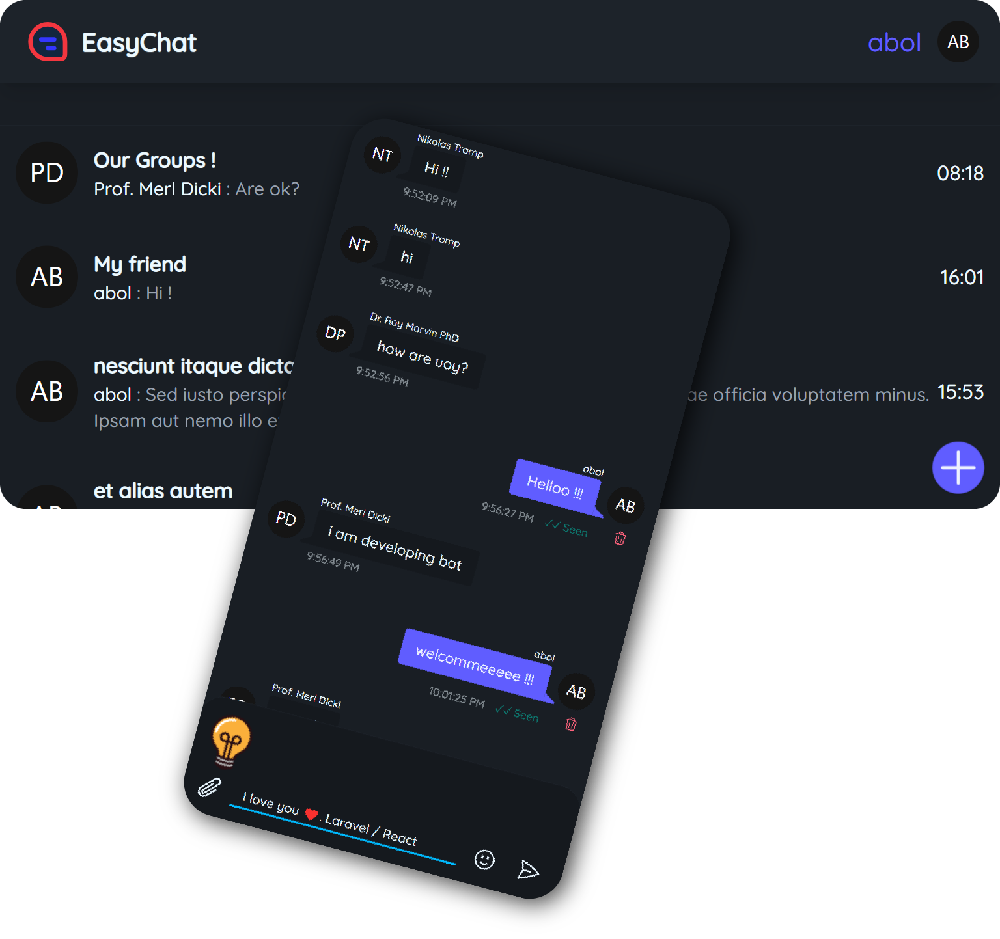

# 🚀 EasyChat - Real-Time Chat Platform

 <!-- Add your screenshots here -->
 <!-- Add your screenshots here -->

A modern real-time chat application built with **Laravel 11** (API backend) and **React 19** (frontend), featuring native WebSocket integration using **Laravel Reverb** ⚡.

## 🌟 Key Features

- 💬 Real-time messaging with WebSocket
- 🔐 Token-based Authentication (Sanctum)
- 📁 File attachments support
- ✏️ Message editing/deleting
- 👀 Typing indicators
- ✅ Read receipts
- 🌑 Dark-first UI with DaisyUI
- 📱 Fully responsive design

## 🛠 Tech Stack

### Core Technologies


### Frontend


### Backend


## 🧠 Why This Stack?
- **Laravel 11**: Robust API development with built-in Sanctum for token-based authentication
- **React 19**: Modern component-based UI with enhanced rendering performance
- **Laravel Reverb**: Native WebSocket server for real-time communication
- **Tailwind 4 + DaisyUI 5**: Utility-first CSS with ready-made components
- **Vite 6**: Blazing fast frontend toolchain

## 📦 Project Structure
```plaintext
easy-chat/                  # Laravel 11 Root
├── app/                    # Core Laravel components
├── client/                 # React 19 Frontend
│   ├── src/                # React components
│   └── vite.config.js      # Vite configuration
├── config/                 # Laravel configs
├── routes/                 # API routes
└── .env.example            # Environment template
```

## 🚀 Installation Guide

### 1. Clone Repository
```bash
git clone https://github.com/abolraj/easy-chat.git
cd easy-chat
```

### 2. Backend Setup
```bash
composer install
cp .env.example .env
php artisan key:generate

# Configure database and reverb in .env
DB_CONNECTION=mysql
DB_HOST=127.0.0.1
DB_PORT=3306
DB_DATABASE=easy_chat
DB_USERNAME=root
DB_PASSWORD=

REVERB_APP_ID=easy_chat
REVERB_APP_KEY=your_secure_key
REVERB_APP_SECRET=your_secret

# Run migrations
php artisan migrate
php artisan db:seed  # Optional for dummy data
```

### 3. Frontend Setup
```bash
cd client
npm install
cp .env.example .env

# Configure Vite in client/.env
VITE_API_URL=http://easy-chat.localhost:8080/api
VITE_WS_HOST=easy-chat.localhost
VITE_WS_PORT=8080
```

### 4. Nginx Configuration (Laragon)
```nginx
server {
    listen 8080;
    server_name easy-chat.localhost *.easy-chat.localhost;
    root "C:/laragon/www/easy-chat/public";
    
    index index.html index.htm index.php;
 
    location / {
        try_files /dist/$uri /dist/$uri/ /index.html?$query_string;
        autoindex on;
    }

    location ~ ^(/api|/sanctum|/broadcasting|/up|/storage) {
        try_files $uri $uri/ /index.php$is_args$args;
        autoindex on;
    }
    
    location ~ \.php$ {
        include snippets/fastcgi-php.conf;
        fastcgi_pass php_upstream;
    }
    
    # Security headers
    location ~ /\.ht {
        deny all;
    }
}
```

## 🏃♂️ Running the Application

### Development Mode
```bash
# Start Laravel backend
php artisan serve
php artisan reverb:start

# Start React frontend (in separate terminal)
cd client
npm run dev
```

### Production Build
```bash
cd client
npm run build  # Outputs to public/dist
```

## 🔧 Key Configuration Files
1. `.env` - Laravel environment (root)
2. `client/.env.development` - React/Vite environment for [development](./client/.env.development) `npm run dev`
3. `client/.env.production` - React/Vite environment for [production](./client/.env.production) `npm run build`
4. `config/reverb.php` - WebSocket config
5. `nginx.conf` - Server configuration

## 👨💻 Connect with Developer
- 🌐 Portfolio: [abolfazlrajaee.ir](https://abolfazlrajaee.ir)
- 💼 LinkedIn: [Abolfazl Rajaee](https://www.linkedin.com/in/abolfazl-rajaee-nasab-195aa3225/)
- 💬 Telegram: [@abol_web](https://t.me/abol_web)
- 🐙 GitHub: [abolraj](https://github.com/abolraj)

## 📄 License
MIT License - See [LICENSE](./LICENSE) for details

---

**Happy Coding!** 🚀 Let's revolutionize real-time communication together!